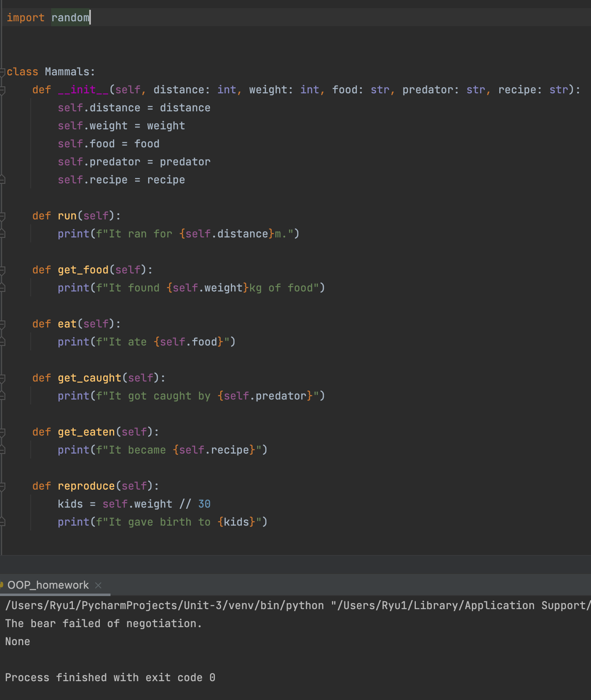
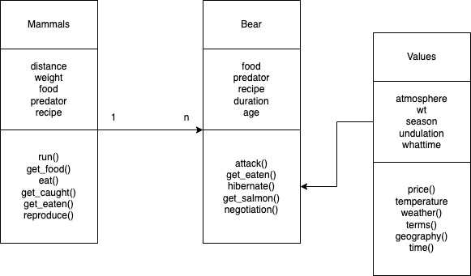

### OOP homework

#### 1-Two classes that are related Parent-child 2-one more class. 3-One of the classes in #1 uses the class in #2 4- Minimum 5 attributes on each class 5-Minimum 6 methods per class 6-Minimum 4 objects per class (tests) Deadline 9 days (23rd Feb) [HLs only] UML diagram


```.py
import random


class Mammals:
    def __init__(self, distance: int, weight: int, food: str, predator: str, recipe: str):
        self.distance = distance
        self.weight = weight
        self.food = food
        self.predator = predator
        self.recipe = recipe

    def run(self):
        print(f"It ran for {self.distance}m.")

    def get_food(self):
        print(f"It found {self.weight}kg of food")

    def eat(self):
        print(f"It ate {self.food}")

    def get_caught(self):
        print(f"It got caught by {self.predator}")

    def get_eaten(self):
        print(f"It became {self.recipe}")

    def reproduce(self):
        kids = self.weight // 30
        print(f"It gave birth to {kids}")


class Bear(Mammals):
    def __init__(self, food: str, predator: str, recipe: str, duration: int, age=5):
        super().__init__(food, predator, recipe, predator, recipe)
        self.age = age
        self.duration = duration
        self.value = Values(15, "sunny", "Spring", "plane", 22)
        self.salmon = 0

    def attack(self):
        print(f"The bear attacked {self.food}")

    def get_eaten(self):
        print(f"The bear is eaten as {self.recipe} by {self.predator}.")

    def hibernate(self, val):
        self.value.temperature(val)
        if self.value.term == "Winter" and self.value.temperature() <= 0:
            print(f"The bear is hibernating for {self.duration} months.")
        else:
            print("The bear is still active.")

    def get_skinned(self, val, new_val):
        self.value.geography(val)
        self.value.price(new_val)
        if self.value.geography == "Mountain" or self.value.geography == "Forest":
            print("The bear could have run away.")
        else:
            print(f"The skin of bear was sold for {self.value.price}")

    def get_salmon(self, num: int):
        self.salmon = 100 * num
        return self.salmon

    def negotiation(self):
        if self.salmon >= self.value.price():
            print(f"The bear negotiated with the hunters and saved its life by paying them {self.salmon}")
        else:
            print("The bear failed of negotiation.")


class Values:
    def __init__(self, atmosphere: int, wt: str, season: str, undulation: str, whattime: int):
        self.atmosphere = atmosphere
        self.wt = wt
        self.season = season
        self.undulation = undulation
        self.whattime = whattime

    def price(self):
        market_price = random.randint(200, 800)
        return market_price

    def temperature(self):
        return self.atmosphere

    def weather(self):
        return self.wt

    def term(self):
        if self.season == "Spring" or self.season == "Summer" or self.season == "Autumn":
            print("Animals are active.")
        elif self.season == "Winter":
            print("Animals are inactive")
        return self.season

    def geography(self):
        return self.undulation

    def time(self):
        if 5 >= self.whattime >= 18:
            print("It is dark now.")
        else:
            print("The sun has risen.")


money = Values(0, "cloudy", "Autumn", "Forest", 14)
activity = Values(15, "rainy", "Summer", "Mountain", 4)
sun = Values(3, "snowing", "Winter", "meadow", 8)
cost = Values(8, "stormy", "Spring", "desert", 12)

meal = Mammals(distance=100, weight=60, food="rabbit", predator="lion", recipe="hamburger")
restaurant = Mammals(distance=40, weight=10, food="gras", predator="tiger", recipe="stew")
children = Mammals(distance=55, weight=50, food="elephant", predator="human", recipe="raw meat")
patrol = Mammals(distance=500, weight=40, food="grasshopper", predator="aligator", recipe="sushi")
death = Bear(food="rabbit", predator="human", recipe="steak", duration=3),

runaway = Bear(food="gorilla", predator="bigfoot", recipe="pasta", duration=2)
runaway.value.geography()
nego = Bear(food="deer", predator="mammoth", recipe="soup", duration=3)
nego.get_salmon(num=100)
sleep = Bear(food="human", predator="human", recipe="tacos", duration=3)
sleep.value.temperature()
```




