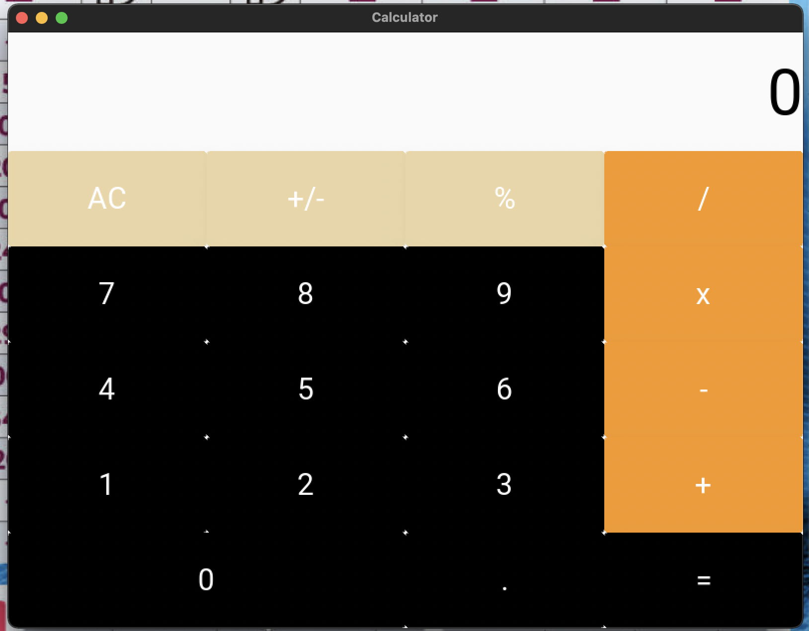

### Calculator using kivyMD


```.py
from kivymd.app import MDApp
from kivymd.uix.screen import MDScreen
from kivymd.uix.label import MDLabel


class Calculator(MDApp):
    def __init__(self, value1: int, value2: str, value3: int, value4: str, operation: str, **kwargs):
        super().__init__(**kwargs)
        self.value1 = value1  # int value of figure typed in
        self.value2 = value2  # str value of figure typed in
        self.value3 = value3  # int value of figure typed in after an operation is entered
        self.value4 = value4  # str value of figure typed in after an operation is entered
        self.operation = operation  # the operation of calculations

    def build(self):
        return

    def ac_btn(self):
        # resets the values
        print("0")
        name = self.root.ids.cal_label.text
        print(name)
        self.root.ids.cal_label.text = "0"
        self.value1 = 0
        self.value2 = "0"
        self.value3 = 0
        self.value4 = "0"
        self.operation = "?"

    def pm_btn(self):
        # plus -> minus, minus -> plus
        self.value1 *= -1
        self.value2 = str(self.value1)
        print(self.value1)
        name = self.root.ids.cal_label.text
        print(name)
        self.root.ids.cal_label.text = str(self.value1)

    def per_btn(self):
        # divide the value by 100
        self.value1 /= 100
        self.value2 = str(self.value1)
        name = self.root.ids.cal_label.text
        print(name)
        self.root.ids.cal_label.text = str(self.value1)

    def div_btn(self):
        # divide value1 by value3
        if self.operation == "+":
            self.value1 += self.value3
            self.value2 = str(self.value1)
            self.operation = "?"
        elif self.operation == "-":
            self.value1 -= self.value3
            self.value2 = str(self.value1)
            self.operation = "?"
        elif self.operation == "*":
            self.value1 *= self.value3
            self.value2 = str(self.value1)
            self.operation = "?"
        elif self.operation == "/":
            self.value1 /= self.value3
            self.value2 = str(self.value1)
            self.operation = "?"
        print(self.value2)
        name = self.root.ids.cal_label.text
        print(name)
        self.root.ids.cal_label.text = self.value2
        self.operation = "/"

    def mul_btn(self):
        # multiply value1 by value3
        if self.operation == "+":
            self.value1 += self.value3
            self.value2 = str(self.value1)
            self.operation = "?"
        elif self.operation == "-":
            self.value1 -= self.value3
            self.value2 = str(self.value1)
            self.operation = "?"
        elif self.operation == "*":
            self.value1 *= self.value3
            self.value2 = str(self.value1)
            self.operation = "?"
        elif self.operation == "/":
            self.value1 /= self.value3
            self.value2 = str(self.value1)
            self.operation = "?"
        self.operation = "*"
        print(self.value2)
        name = self.root.ids.cal_label.text
        print(name)
        self.root.ids.cal_label.text = self.value2
        self.operation = "*"

    def plus_btn(self):
        # add value1 to value3
        if self.operation == "+":
            self.value1 += self.value3
            self.value2 = str(self.value1)
            self.operation = "?"
        elif self.operation == "-":
            self.value1 -= self.value3
            self.value2 = str(self.value1)
            self.operation = "?"
        elif self.operation == "*":
            self.value1 *= self.value3
            self.value2 = str(self.value1)
            self.operation = "?"
        elif self.operation == "/":
            self.value1 /= self.value3
            self.value2 = str(self.value1)
            self.operation = "?"
        self.operation = "+"
        print(self.value2)
        name = self.root.ids.cal_label.text
        print(name)
        self.root.ids.cal_label.text = self.value2
        self.operation = "+"

    def minus_btn(self):
        # subtract value3 from value1
        if self.operation == "+":
            self.value1 += self.value3
            self.value2 = str(self.value1)
            self.operation = "?"
        elif self.operation == "-":
            self.value1 -= self.value3
            self.value2 = str(self.value1)
            self.operation = "?"
        elif self.operation == "*":
            self.value1 *= self.value3
            self.value2 = str(self.value1)
            self.operation = "?"
        elif self.operation == "/":
            self.value1 /= self.value3
            self.value2 = str(self.value1)
            self.operation = "?"
        self.operation = "-"
        print(self.value2)
        name = self.root.ids.cal_label.text
        print(name)
        self.root.ids.cal_label.text = self.value2
        self.operation = "-"

    def seven_btn(self):
        # set value1 or value3 to be 7
        if self.operation == "?":
            if self.value1 == 0:
                self.value1 = 7
                self.value2 = str(self.value1)
                print(self.value2)
                name = self.root.ids.cal_label.text
                print(name)
                self.root.ids.cal_label.text = self.value2
                self.operation = "?"
            else:
                self.value2 += "7"
                self.value1 = int(self.value2)
                print(self.value2)
                name = self.root.ids.cal_label.text
                print(name)
                self.root.ids.cal_label.text = self.value2
                self.operation = "?"
        else:
            if self.value3 == 0:
                self.value3 = 7
                self.value4 = str(self.value3)
                print(self.value4)
                name = self.root.ids.cal_label.text
                print(name)
                self.root.ids.cal_label.text = self.value4
            else:
                self.value4 += "7"
                self.value3 = int(self.value4)
                print(self.value4)
                name = self.root.ids.cal_label.text
                print(name)
                self.root.ids.cal_label.text = self.value4

    def eight_btn(self):
        # set value1 or value3 to be 8
        if self.operation == "?":
            if self.value1 == 0:
                self.value1 = 8
                self.value2 = str(self.value1)
                print(self.value2)
                name = self.root.ids.cal_label.text
                print(name)
                self.root.ids.cal_label.text = self.value2
                self.operation = "?"
            else:
                self.value2 += "8"
                self.value1 = int(self.value2)
                print(self.value2)
                name = self.root.ids.cal_label.text
                print(name)
                self.root.ids.cal_label.text = self.value2
                self.operation = "?"
        else:
            if self.value3 == 0:
                self.value3 = 8
                self.value4 = str(self.value3)
                print(self.value4)
                name = self.root.ids.cal_label.text
                print(name)
                self.root.ids.cal_label.text = self.value4
            else:
                self.value4 += "8"
                self.value3 = int(self.value4)
                print(self.value4)
                name = self.root.ids.cal_label.text
                print(name)
                self.root.ids.cal_label.text = self.value4

    def nine_btn(self):
        # set value1 or value3 to be 9
        if self.operation == "?":
            if self.value1 == 0:
                self.value1 = 9
                self.value2 = str(self.value1)
                print(self.value2)
                name = self.root.ids.cal_label.text
                print(name)
                self.root.ids.cal_label.text = self.value2
                self.operation = "?"
            else:
                self.value2 += "9"
                self.value1 = int(self.value2)
                print(self.value2)
                name = self.root.ids.cal_label.text
                print(name)
                self.root.ids.cal_label.text = self.value2
                self.operation = "?"
        else:
            if self.value3 == 0:
                self.value3 = 9
                self.value4 = str(self.value3)
                print(self.value4)
                name = self.root.ids.cal_label.text
                print(name)
                self.root.ids.cal_label.text = self.value4
            else:
                self.value4 += "9"
                self.value3 = int(self.value4)
                print(self.value4)
                name = self.root.ids.cal_label.text
                print(name)
                self.root.ids.cal_label.text = self.value4

    def one_btn(self):
        # set value1 or value3 to be 1
        if self.operation == "?":
            if self.value1 == 0:
                self.value1 = 1
                self.value2 = str(self.value1)
                print(self.value2)
                name = self.root.ids.cal_label.text
                print(name)
                self.root.ids.cal_label.text = self.value2
                self.operation = "?"
            else:
                self.value2 += "1"
                self.value1 = int(self.value2)
                print(self.value2)
                name = self.root.ids.cal_label.text
                print(name)
                self.root.ids.cal_label.text = self.value2
                self.operation = "?"
        else:
            if self.value3 == 0:
                self.value3 = 1
                self.value4 = str(self.value3)
                print(self.value4)
                name = self.root.ids.cal_label.text
                print(name)
                self.root.ids.cal_label.text = self.value4
            else:
                self.value4 += "1"
                self.value3 = int(self.value4)
                print(self.value4)
                name = self.root.ids.cal_label.text
                print(name)
                self.root.ids.cal_label.text = self.value4

    def two_btn(self):
        # set value1 or value3 to be 2
        if self.operation == "?":
            if self.value1 == 0:
                self.value1 = 2
                self.value2 = str(self.value1)
                print(self.value2)
                name = self.root.ids.cal_label.text
                print(name)
                self.root.ids.cal_label.text = self.value2
                self.operation = "?"
            else:
                self.value2 += "2"
                self.value1 = int(self.value2)
                print(self.value2)
                name = self.root.ids.cal_label.text
                print(name)
                self.root.ids.cal_label.text = self.value2
                self.operation = "?"
        else:
            if self.value3 == 0:
                self.value3 = 2
                self.value4 = str(self.value3)
                print(self.value4)
                name = self.root.ids.cal_label.text
                print(name)
                self.root.ids.cal_label.text = self.value4
            else:
                self.value4 += "2"
                self.value3 = int(self.value4)
                print(self.value4)
                name = self.root.ids.cal_label.text
                print(name)
                self.root.ids.cal_label.text = self.value4

    def three_btn(self):
        # set value1 or value3 to be 3
        if self.operation == "?":
            if self.value1 == 0:
                self.value1 = 3
                self.value2 = str(self.value1)
                print(self.value2)
                name = self.root.ids.cal_label.text
                print(name)
                self.root.ids.cal_label.text = self.value2
                self.operation = "?"
            else:
                self.value2 += "3"
                self.value1 = int(self.value2)
                print(self.value2)
                name = self.root.ids.cal_label.text
                print(name)
                self.root.ids.cal_label.text = self.value2
                self.operation = "?"
        else:
            if self.value3 == 0:
                self.value3 = 3
                self.value4 = str(self.value3)
                print(self.value4)
                name = self.root.ids.cal_label.text
                print(name)
                self.root.ids.cal_label.text = self.value4
            else:
                self.value4 += "3"
                self.value3 = int(self.value4)
                print(self.value4)
                name = self.root.ids.cal_label.text
                print(name)
                self.root.ids.cal_label.text = self.value4

    def four_btn(self):
        # set value1 or value3 to be 4
        if self.operation == "?":
            if self.value1 == 0:
                self.value1 = 4
                self.value2 = str(self.value1)
                print(self.value2)
                name = self.root.ids.cal_label.text
                print(name)
                self.root.ids.cal_label.text = self.value2
                self.operation = "?"
            else:
                self.value2 += "4"
                self.value1 = int(self.value2)
                print(self.value2)
                name = self.root.ids.cal_label.text
                print(name)
                self.root.ids.cal_label.text = self.value2
                self.operation = "?"
        else:
            if self.value3 == 0:
                self.value3 = 4
                self.value4 = str(self.value3)
                print(self.value4)
                name = self.root.ids.cal_label.text
                print(name)
                self.root.ids.cal_label.text = self.value4
            else:
                self.value4 += "4"
                self.value3 = int(self.value4)
                print(self.value4)
                name = self.root.ids.cal_label.text
                print(name)
                self.root.ids.cal_label.text = self.value4

    def five_btn(self):
        # set value1 or value3 to be 5
        if self.operation == "?":
            if self.value1 == 0:
                self.value1 = 5
                self.value2 = str(self.value1)
                print(self.value2)
                name = self.root.ids.cal_label.text
                print(name)
                self.root.ids.cal_label.text = self.value2
                self.operation = "?"
            else:
                self.value2 += "5"
                self.value1 = int(self.value2)
                print(self.value2)
                name = self.root.ids.cal_label.text
                print(name)
                self.root.ids.cal_label.text = self.value2
                self.operation = "?"
        else:
            if self.value3 == 0:
                self.value3 = 5
                self.value4 = str(self.value3)
                print(self.value4)
                name = self.root.ids.cal_label.text
                print(name)
                self.root.ids.cal_label.text = self.value4
            else:
                self.value4 += "5"
                self.value3 = int(self.value4)
                print(self.value4)
                name = self.root.ids.cal_label.text
                print(name)
                self.root.ids.cal_label.text = self.value4

    def six_btn(self):
        # set value1 or value3 to be 6
        if self.operation == "?":
            if self.value1 == 0:
                self.value1 = 6
                self.value2 = str(self.value1)
                print(self.value2)
                name = self.root.ids.cal_label.text
                print(name)
                self.root.ids.cal_label.text = self.value2
                self.operation = "?"
            else:
                self.value2 += "6"
                self.value1 = int(self.value2)
                print(self.value2)
                name = self.root.ids.cal_label.text
                print(name)
                self.root.ids.cal_label.text = self.value2
                self.operation = "?"
        else:
            if self.value3 == 0:
                self.value3 = 6
                self.value4 = str(self.value3)
                print(self.value4)
                name = self.root.ids.cal_label.text
                print(name)
                self.root.ids.cal_label.text = self.value4
            else:
                self.value4 += "6"
                self.value3 = int(self.value4)
                print(self.value4)
                name = self.root.ids.cal_label.text
                print(name)
                self.root.ids.cal_label.text = self.value4

    def zero_btn(self):
        # set value1 or value3 to be 0
        if self.operation == "?":
            if self.value1 == 0:
                self.value1 = 0
                self.value2 = str(self.value1)
                print(self.value2)
                name = self.root.ids.cal_label.text
                print(name)
                self.root.ids.cal_label.text = self.value2
                self.operation = "?"
            else:
                self.value2 += "0"
                self.value1 = int(self.value2)
                print(self.value2)
                name = self.root.ids.cal_label.text
                print(name)
                self.root.ids.cal_label.text = self.value2
                self.operation = "?"
        else:
            if self.value3 == 0:
                self.value3 = 0
                self.value4 = str(self.value3)
                print(self.value4)
                name = self.root.ids.cal_label.text
                print(name)
                self.root.ids.cal_label.text = self.value4
            else:
                self.value4 += "0"
                self.value3 = int(self.value4)
                print(self.value4)
                name = self.root.ids.cal_label.text
                print(name)
                self.root.ids.cal_label.text = self.value4

    def equal_btn(self):
        # Calculate and show the value
        if self.operation == "+":
            self.value1 += self.value3
            self.value2 = str(self.value1)
            self.operation = "?"
        elif self.operation == "-":
            self.value1 -= self.value3
            self.value2 = str(self.value1)
            self.operation = "?"
        elif self.operation == "*":
            self.value1 *= self.value3
            self.value2 = str(self.value1)
            self.operation = "?"
        elif self.operation == "/":
            self.value1 /= self.value3
            self.value2 = str(self.value1)
            self.operation = "?"
        print(self.value2)
        name = self.root.ids.cal_label.text
        print(name)
        self.root.ids.cal_label.text = self.value2
        self.value1 = 0
        self.value2 = "0"
        self.value3 = 0
        self.value4 = "0"
        self.operation = "?"

    def period_btn(self):
        # floating numbers
        if self.operation == "?":
            self.value2 += "."
        else:
            self.value4 += "."


m = Calculator(value1=0, value2="", value3=0, value4="", operation="?")
m.run()
```

```.py
Screen:
    size: 500, 300

    MDBoxLayout:
    # Layout of keys
        orientation: "vertical"
        size_hint: 1, 1

        MDLabel:
        # where it shows the actual figures of calculation
            id: cal_label
            text: "0"
            theme_text_color: "Custom"
            text_color: 0, 0, 0, 1
            halign: "right"
            size_hint: 1, .2
            font_size: "64px"

        MDGridLayout:
        # Layout of keys
            md_bg_color: app.theme_cls.primary_color
            cols: 4
            rows: 4
            size_hint: 1, .64
            md_bg_color: 0, 0, 0, 0

            MDRaisedButton:
            # button for AC
                id: ac_btn
                text: "AC"
                size_hint: .25, .2
                font_size: "30px"
                #RGB code
                md_bg_color: .91, .84, .67, 1
                on_release:
                    app.ac_btn()

            MDRaisedButton:
            # button for +/-
                id: pm_btn
                size_hint: .25, .2
                text: "+/-"
                font_size: "30px"
                #RGB code
                md_bg_color: .91, .84, .67, 1
                on_release:
                    app.pm_btn()

            MDRaisedButton:
            # button for %
                id: per_btn
                size_hint: .25, .2
                text: "%"
                font_size: "30px"
                #RGB code
                md_bg_color: .91, .84, .67, 1
                on_release:
                    app.per_btn()

            MDRaisedButton:
            # button for /
                id: div_btn
                size_hint: .25, .2
                text: "/"
                font_size: "30px"
                #RGB code
                md_bg_color: .92, .61, .24, 1
                on_release:
                    app.div_btn()

            MDRaisedButton:
            # button for 7
                id: seven_btn
                size_hint: .25, .2
                text: "7"
                font_size: "30px"
                #RGB code
                md_bg_color: 0, 0, 0, 1
                on_release:
                    app.seven_btn()

            MDRaisedButton:
            # button for 8
                id: eight_btn
                size_hint: .25, .2
                text: "8"
                font_size: "30px"
                #RGB code
                md_bg_color: 0, 0, 0, 1
                on_release:
                    app.eight_btn()

            MDRaisedButton:
            # button for 9
                id: nine_btn
                size_hint: .25, .2
                text: "9"
                font_size: "30px"
                #RGB code
                md_bg_color: 0, 0, 0, 1
                on_release:
                    app.nine_btn()

            MDRaisedButton:
            # button for x
                id: mul_btn
                size_hint: .25, .2
                text: "x"
                font_size: "30px"
                #RGB code
                md_bg_color: .92, .61, .24, 1
                on_release:
                    app.mul_btn()

            MDRaisedButton:
            # button for 4
                id: four_btn
                size_hint: .25, .2
                text: "4"
                font_size: "30px"
                #RGB code
                md_bg_color: 0, 0, 0, 1
                on_release:
                    app.four_btn()

            MDRaisedButton:
            # button for 5
                id: five_btn
                size_hint: .25, .2
                text: "5"
                font_size: "30px"
                #RGB code
                md_bg_color: 0, 0, 0, 1
                on_release:
                    app.five_btn()

            MDRaisedButton:
            # button for 6
                id: six_btn
                size_hint: .25, .2
                text: "6"
                font_size: "30px"
                #RGB code
                md_bg_color: 0, 0, 0, 1
                on_release:
                    app.six_btn()

            MDRaisedButton:
            # button for -
                id: minus_btn
                size_hint: .25, .2
                text: "-"
                font_size: "30px"
                #RGB code
                md_bg_color: .92, .61, .24, 1
                on_release:
                    app.minus_btn()

            MDRaisedButton:
            # button for 1
                id: one_btn
                size_hint: .25, .2
                text: "1"
                font_size: "30px"
                #RGB code
                md_bg_color: 0, 0, 0, 1
                on_release:
                    app.one_btn()

            MDRaisedButton:
            # button for 2
                id: two_btn
                size_hint: .25, .2
                text: "2"
                font_size: "30px"
                #RGB code
                md_bg_color: 0, 0, 0, 1
                on_release:
                    app.two_btn()

            MDRaisedButton:
            # button for 3
                id: three_btn
                size_hint: .25, .2
                text: "3"
                font_size: "30px"
                #RGB code
                md_bg_color: 0, 0, 0, 1
                on_release:
                    app.three_btn()

            MDRaisedButton:
            # button for +
                id: plus_btn
                size_hint: .25, .2
                text: "+"
                font_size: "30px"
                #RGB code
                md_bg_color: .92, .61, .24, 1
                on_release:
                    app.plus_btn()

        MDBoxLayout:
        # Layout of keys
            orientation: "horizontal"
            size_hint: 1, .16

            MDRaisedButton:
            # button for 0
                id: zero_btn
                size_hint: .5, 1
                text: "0"
                font_size: "30px"
                #RGB code
                md_bg_color: 0, 0, 0, 1
                on_release:
                    app.zero_btn()

            MDRaisedButton:
            # button for .
                id: period_btn
                size_hint: .25, 1
                text: "."
                font_size: "30px"
                #RGB code
                md_bg_color: 0, 0, 0, 1
                on_release:
                    app.period_btn()

            MDRaisedButton:
            # button for =
                id: equal_btn
                size_hint: .25, 1
                text: "="
                font_size: "30px"
                #RGB code
                md_bg_color: 0, 0, 0, 1
                on_release:
                    app.equal_btn()
```


