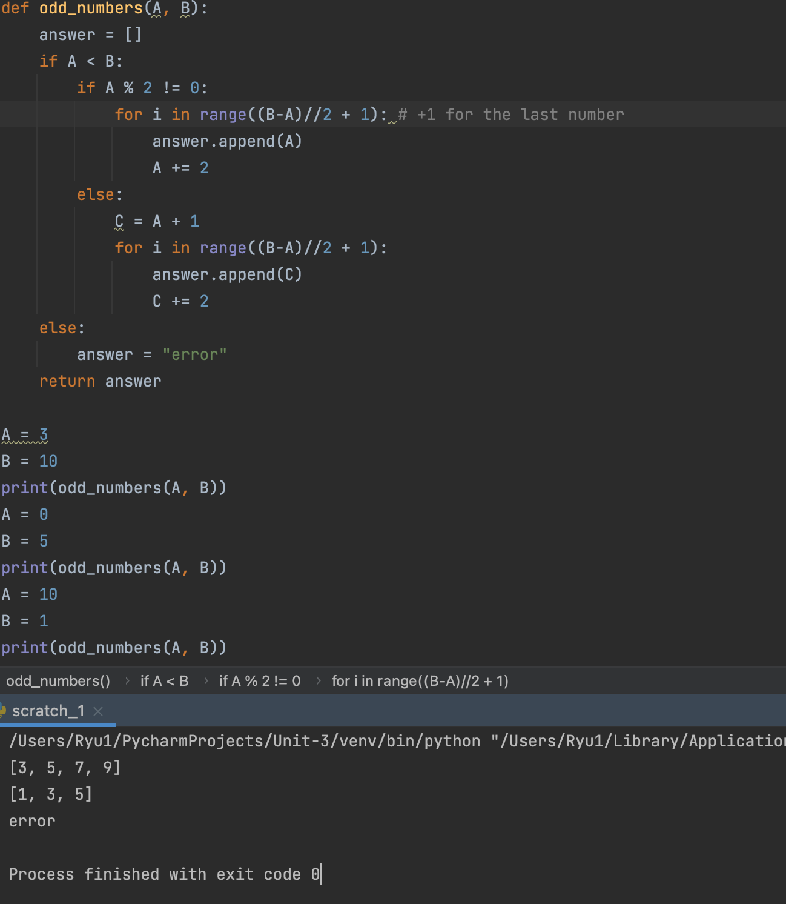

### Odd numbers

```.py
def odd_numbers(A, B):
    answer = []
    if A < B:
        if A % 2 != 0:
            for i in range((B-A)//2 + 1): # +1 for the last number
                answer.append(A)
                A += 2
        else:
            C = A + 1
            for i in range((B-A)//2 + 1):
                answer.append(C)
                C += 2
    else:
        answer = "error"
    return answer
```


