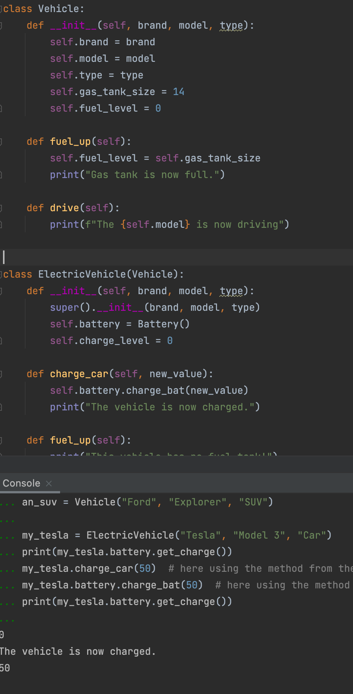

### Vehicle

```.py
class Vehicle:
    def __init__(self, brand, model, type):
        self.brand = brand
        self.model = model
        self.type = type
        self.gas_tank_size = 14
        self.fuel_level = 0

    def fuel_up(self):
        self.fuel_level = self.gas_tank_size
        print("Gas tank is now full.")

    def drive(self):
        print(f"The {self.model} is now driving")


class ElectricVehicle(Vehicle):
    def __init__(self, brand, model, type):
        super().__init__(brand, model, type)
        self.battery = Battery()
        self.charge_level = 0

    def charge_car(self, new_value):
        self.battery.charge_bat(new_value)
        print("The vehicle is now charged.")

    def fuel_up(self):
        print("This vehicle has no fuel tank!")


class Battery:
    """A class to represent a battery bank. By default its size is 20 kwh"""

    def __init__(self, size: int = 20):
        self.size = size
        self.charge_level = 0

    def get_charge(self):
        """This method return the current charge level"""
        return self.charge_level

    def get_range(self):
        """ This method returns an estimated of the km that the car can drive"""

    def charge_bat(self, new_value):
        self.charge_level = new_value

    def __repr__(self):
        return f"<This is a Battery> size {self.size} charge {self.charge_level}"


vehicle_object = Vehicle("Honda", "Ridgeline", "Truck")
a_subaru = Vehicle("Subaru", "Forester", "Crossover")
an_suv = Vehicle("Ford", "Explorer", "SUV")

my_tesla = ElectricVehicle("Tesla", "Model 3", "Car")
print(my_tesla.battery.get_charge())
my_tesla.charge_car(50)  # here using the method from the electric vehicle
my_tesla.battery.charge_bat(50)  # here using the method form the battery
print(my_tesla.battery.get_charge())
```


