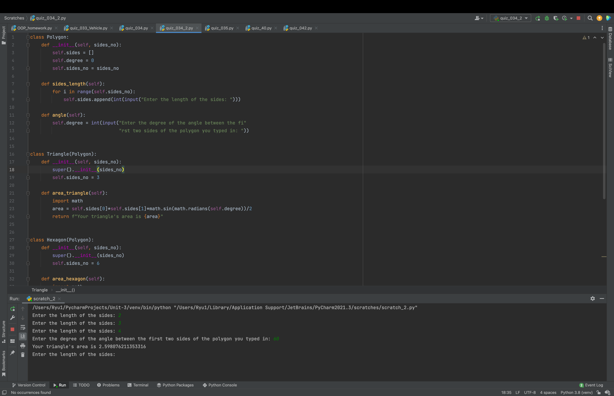

### Polygon

```.py
class Polygon:
    def __init__(self, sides_no):
        self.sides = []
        self.degree = 0
        self.sides_no = sides_no

    def sides_length(self):
        for i in range(self.sides_no):
            self.sides.append(int(input("Enter the length of the sides: ")))

    def angle(self):
        self.degree = int(input("Enter the degree of the angle between the fi"
                                "rst two sides of the polygon you typed in: "))


class Triangle(Polygon):
    def __init__(self, sides_no):
        super().__init__(sides_no)
        self.sides_no = 3

    def area_triangle(self):
        import math
        area = self.sides[0]*self.sides[1]*math.sin(math.radians(self.degree))/2
        return f"Your triangle's area is {area}"


class Hexagon(Polygon):
    def __init__(self, sides_no):
        super().__init__(sides_no)
        self.sides_no = 6

    def area_hexagon(self):
        import math
        area = (3 * math.sqrt(3) * (self.sides[0] ** 2)) / 2
        return f"The area of your hexagon is {area}."
```


