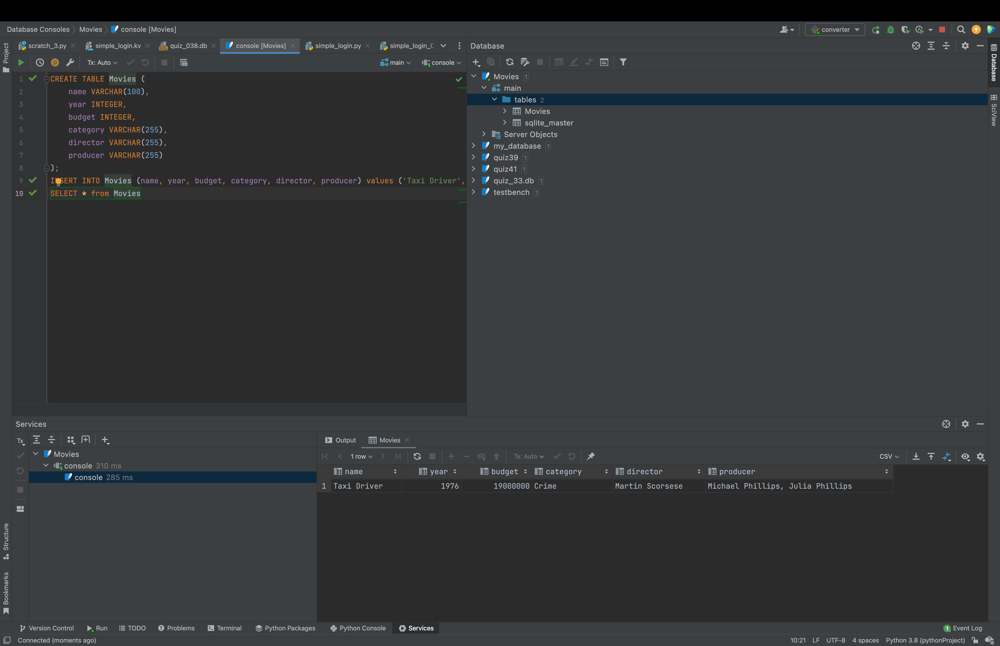

### Movies

```.sql
CREATE TABLE Movies (
""" attributes """
    name VARCHAR(100),
    year INTEGER,
    budget INTEGER,
    category VARCHAR(255),
    director VARCHAR(255),
    producer VARCHAR(255)
);
""" adds all the values to the list """
INSERT INTO Movies (name, year, budget, category, director, producer) values ('Taxi Driver', 1976, 19000000, 'Crime', 'Martin Scorsese', 'Michael Phillips, Julia Phillips');
""" shows all the values on the list """
SELECT * from Movies
```


