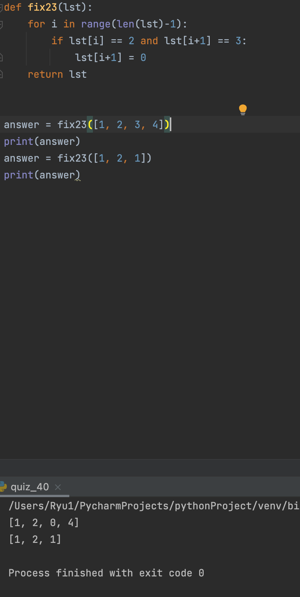
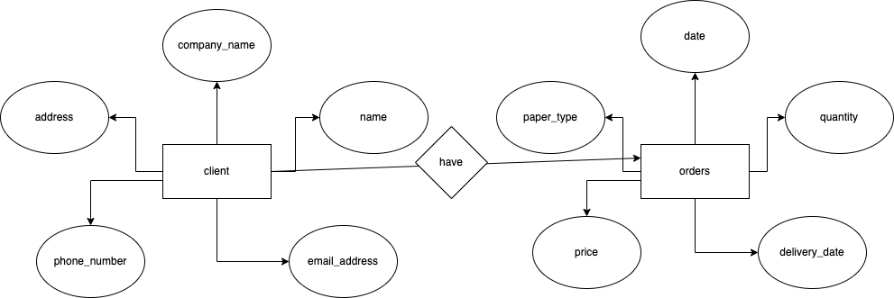

### SQL

```.py
# makes a table and columns on it
CREATE TABLE  orders (
    date INTEGER,
    paper_type VARCHAR(100),
    quantity INTEGER,
    price INTEGER,
    delivery_date INTEGER
);

CREATE TABLE  client (
    name VARCHAR(100),
    address VARCHAR(100),
    phone_number INTEGER,
    email_address VARCHAR(100),
    company_name VARCHAR(100)
);
```




